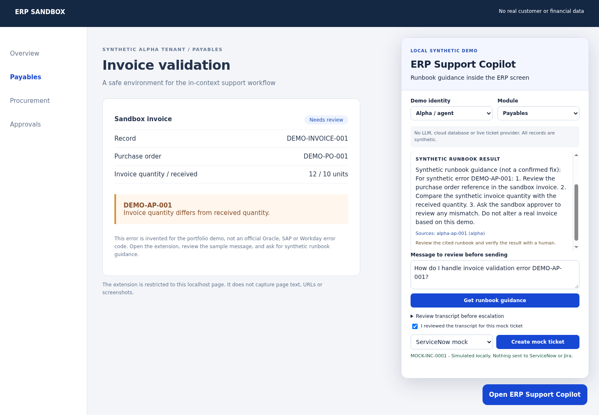

# ERP Support Copilot

A local portfolio demo of in-context ERP support: open a browser sidebar, ask for runbook guidance, review the source, and choose whether to create a mock support ticket.

## The problem

ERP users often leave the application to describe an error to support. That handoff loses context and adds repetitive work. This project explores a support sidebar that keeps the troubleshooting and escalation flow next to the application screen.

This release demonstrates the workflow, not a measured reduction in support volume. It uses an invented invoice error and synthetic runbooks. It does not claim to resolve real ERP issues.



## What runs here

- A Chrome Manifest V3 extension restricted to one local sandbox route.
- A FastAPI backend with bounded inputs and server-assigned sessions.
- Tenant- and module-filtered lexical runbook retrieval with visible source IDs.
- Session and ticket ownership checks scoped to tenant **and** principal.
- ServiceNow and Jira mocks that require explicit transcript confirmation.
- Automated API, context-matching and browser smoke tests.

No API key, cloud account, database wallet or customer data is needed. There are no remote model or ticket-provider calls. The response is a deterministic runbook excerpt, not an LLM answer. The repo name includes "AI" because this is a demo slice of an AI support project, not because this local release runs an AI model.

## Architecture

```text
Synthetic ERP screen
  -> unpacked Chrome/Edge extension
  -> sidebar iframe hosted on the same loopback backend
  -> FastAPI /api/chat
       -> documented demo identity -> tenant + principal
       -> session ownership check
       -> synthetic runbook retrieval (tenant + module filters)
       -> cited excerpt or "no supporting source"
  -> reviewed transcript + explicit confirmation
  -> /api/tickets -> in-memory ServiceNow/Jira mock
```

The original private project uses Gemini, Oracle Autonomous Database vector retrieval, document ingestion, admin screens and ticket-provider adapters. Those live paths are deliberately absent here. This demo must not be used as evidence that the original deployment has production-grade isolation or reliability.

## Quick start

Python 3.10+ is required. Tested locally on Python 3.10; the included CI configuration targets Python 3.11, but has not run on GitHub yet.

```bash
python -m venv .venv
source .venv/bin/activate
pip install -r requirements.txt
python -m uvicorn app.main:app --host 127.0.0.1 --port 8002
```

On Windows, activate with `.venv\Scripts\activate` instead. Keep the loopback bind. Do not deploy this demo on a public interface.

1. Open Chrome's extensions page or Edge's extensions page.
2. Enable Developer mode and load the `extension/` folder unpacked.
3. Open `http://127.0.0.1:8002/demo/erp`.
4. Click **Open ERP Support Copilot**.
5. Review the sample message and click **Get runbook guidance**.
6. Inspect source `alpha-ap-001`. The result is guidance, not a confirmed fix.
7. Expand the transcript, review it, check the confirmation box and create a mock ticket.
8. Switch to Beta / agent and ask the same question. Only the beta fixture is retrieved.
9. Ask an unknown question to see the no-source path. Three unverified turns also suggest human review.

A standalone widget is available at `http://127.0.0.1:8002/widget/widget.html`. It is a fallback UI preview and does not demonstrate extension injection. The screenshot above was captured with the actual unpacked extension, not the fallback.

## Synthetic identities and isolation

The `X-Demo-Identity` header accepts `alpha-agent`, `alpha-reviewer` and `beta-agent`. They are public aliases, not passwords or secure login tokens. Anyone with access to the local server can choose one. Tenant scope is derived from the identity mapping, never from a request body's tenant field.

Tests check that different demo principals cannot retrieve, continue or create tickets from another principal's session, including within the same tenant. Retrieval tests check that alpha does not receive beta's runbook. These are useful regression checks on this demo's code paths, not proof of secure real-world multi-tenancy.

A real deployment needs authenticated principals, server-side authorization, database-level tenant controls, retention policies, rate limits and an independent security review. CORS is not authentication.

## Tests and reproducible screenshot

```bash
pip install -r requirements-dev.txt
python -m pytest -q
node tests/patterns.cjs
python scripts/scan_release.py
```

The browser smoke test loads the actual MV3 extension, exercises both ticket mocks, switches tenants and checks that HTML-like input renders as text:

```bash
python -m playwright install chromium
# Linux with a virtual display; install Xvfb through your OS if needed:
xvfb-run -a python scripts/browser_smoke.py
# On a workstation with a display:
python scripts/browser_smoke.py
```

Port 8002 must be free for the browser smoke test. It starts a temporary loopback server, captures `docs/demo-running.png`, writes `docs/browser-smoke.json`, and stops the server. Node is needed only for the hostname/context tests.

## Safety choices

- No automatic DOM error capture, page URL submission or screenshots.
- No `<all_urls>` extension permission; only the local sandbox route is matched.
- No model-reported confidence score. Evidence availability and unresolved turns guide suggestions, not claims of correctness.
- A runbook match never sets `resolved=true`.
- No automatic ticket send. Both ticket providers are explicit mocks.
- Duplicate mock ticket submissions for the same identity, session and provider return the existing mock ticket.
- Text is rendered with `textContent`, not untrusted HTML.
- Demo state is in memory and disappears on restart. The demo caps sessions and conversation turns; it is not a long-running service.

## Limits

This is a narrowed, adapted demo rather than a full extraction of the original service. Lexical retrieval is not semantic vector search or generative RAG. Its keyword matches can be weak or wrong; users must inspect the cited runbook. Real Oracle, SAP and Workday interfaces and Edge extension behavior have not been tested in this release. Context patterns inherited from the original are examples, not a compatibility guarantee. Browser testing used Playwright Chromium on Linux.

Live Gemini, Oracle ADB, ServiceNow and Jira integrations, PDF ingestion, admin dashboards, production authentication, screenshots and deployment services are out of scope. No real ticket, ERP change or live provider test is included.

## Provenance and license

The context pattern table and chunking approach were adapted from the private ERP Support Extension. The demo API, fixtures, widget and mock providers were written for this review package. Details are in [scope changes](docs/SCOPE_CHANGES.md).

[MIT](LICENSE). Copyright (c) 2026 Hsie I Hsuan. Dependencies retain their own licenses.
